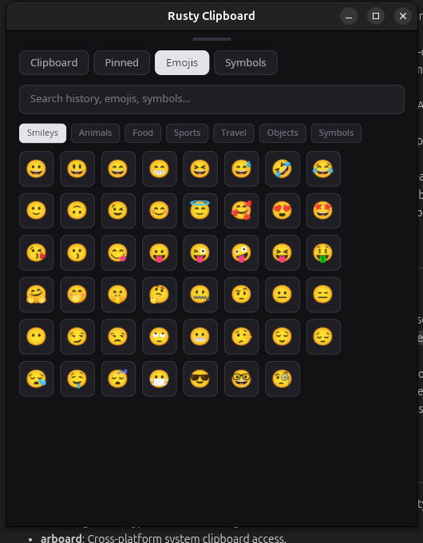

# Rusty Clipboard

A high-performance Linux Desktop Clipboard Manager built in Rust using Iced for the user interface and heed (LMDB) for local key-value storage.


## Features

- **Clipboard History**: Automatically monitors and saves copied text snippets and raw RGBA images from the system clipboard.
- **Embedded Database (`heed`)**: Uses LMDB for fast, zero-copy, transactional local storage.
- **Pinned Items**: Pin important text or images to prevent them from being removed when clearing clipboard history.
- **Emoji Picker**: Searchable catalog of emojis grouped by categories (Smileys, Animals, Food, Sports, Travel, Objects, Symbols).
- **Symbol Picker**: Quick access to currency symbols, mathematical operators, punctuation marks, arrows, and Greek letters.
- **Neutral Onyx Dark Theme**: Sleek, professional dark mode UI built with custom Iced styling.
- **Linux Application Integration**: Desktop launcher entry and icon support for seamless execution from your system application menu.

## Architecture

- `src/main.rs`: Entry point initializing the Iced application window, database, and background listener thread.
- `src/db.rs`: Database layer wrapping `heed::Env` and `heed::Database` for storing serialized clipboard items.
- `src/clipboard_listener.rs`: Background worker polling system clipboard changes using `arboard`.
- `src/app.rs`: State management, event handling, and neutral dark view layout implemented using Iced.
- `src/catalog.rs`: Static catalogs for emojis and symbols.
- `src/types.rs`: Core data types and models.

## Installation (Run as a Linux Desktop Application)

To install Rusty Clipboard into your Linux desktop menu so you can launch it like any installed application:

```bash
chmod +x install.sh
./install.sh
```

This script will:
1. Compile the app in `--release` mode.
2. Install the binary to `~/.local/bin/rusty_clipboard`.
3. Install the application icon to `~/.local/share/icons/hicolor/scalable/apps/rusty-clipboard.svg`.
4. Install the desktop launcher to `~/.local/share/applications/rusty-clipboard.desktop`.

Once installed, search for **"Rusty Clipboard"** in your application launcher (GNOME / KDE / XFCE / App Menu) or run `rusty_clipboard` from any terminal.

### Uninstalling

To remove the installed binary and desktop shortcuts:

```bash
chmod +x uninstall.sh
./uninstall.sh
```

## License

MIT License.
